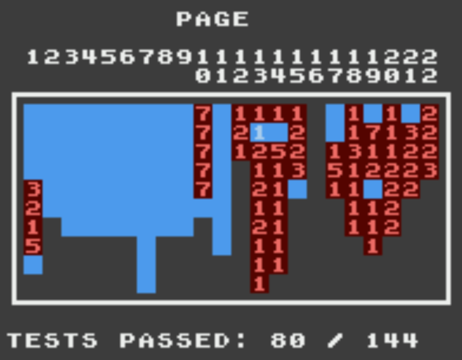

# Nes
Some dabbling with C# and an NES Emulator

The solution is set up with two projects. One for the main emulation code, the other mainly for displaying something on the screen using MonoGame

## Next Steps
Extend the APU and fix the PPU bugs.

## Known Bugs
(At least) In SMB there are some graphical bugs just after the header area of the screen sometimes, and (I think) some issues with sprite overflow. I haven't debugged any of that yet

## Accuracy
100thCoin provided a nice ROM to check the accuracy here on Github [100thCoin/AccuracyCoin](https://github.com/100thCoin/AccuracyCoin)

Here's my result:

